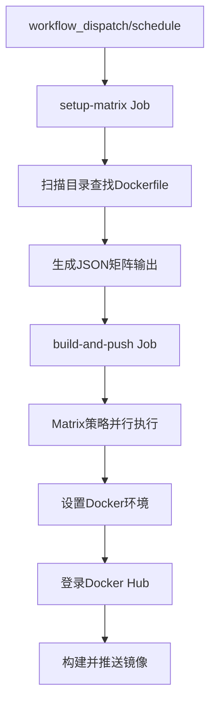

# GitHub Actions工作流程测试计划

## 测试目标
使用act工具本地测试GitHub Actions工作流程，验证逻辑正确性，不实际构建和推送Docker镜像。

## 工作流程分析

### 当前工作流程结构


### 已知问题
1. JSON输出格式错误：`Error: Invalid format '  "nginx",'`
2. 需要模拟Docker Hub认证
3. 需要避免实际构建和推送镜像

## 测试策略

### 阶段1：环境准备
1. 验证act工具和Docker环境
2. 修复JSON输出格式问题
3. 创建测试配置文件

### 阶段2：单元测试
1. 测试setup-matrix任务（目录扫描和矩阵生成）
2. 验证JSON输出格式正确性

### 阶段3：集成测试
1. 使用dry-run模式测试完整工作流程
2. 模拟secrets和Docker操作
3. 分析测试结果

## 修复方案

### JSON输出格式修复
将原来的：
```bash
echo "images=${IMAGES}" >> $GITHUB_OUTPUT
```

修改为：
```bash
{
  echo "images<<EOF"
  echo "${IMAGES}"
  echo "EOF"
} >> $GITHUB_OUTPUT
```

### 测试配置
1. 创建`.actrc`文件配置act参数
2. 创建`.secrets`文件模拟Docker Hub凭据
3. 使用`--dryrun`参数避免实际执行

## 测试命令

### 单独测试setup-matrix任务
```bash
act -j setup-matrix --dryrun
```

### 测试完整工作流程
```bash
act -j build-and-push --dryrun -s DOCKERHUB_USERNAME=test -s DOCKERHUB_TOKEN=test
```

## 预期结果
1. setup-matrix任务应正确输出：`["nginx", "python-app"]`
2. build-and-push任务应正确解析矩阵并创建两个并行任务
3. 所有步骤应在dry-run模式下成功执行，不实际构建镜像

## 风险与缓解措施
1. **风险**：Docker操作可能实际执行
   **缓解**：使用--dryrun参数
2. **风险**：secrets配置错误
   **缓解**：创建测试用的secrets文件
3. **风险**：网络依赖问题
   **缓解**：使用act的离线模式