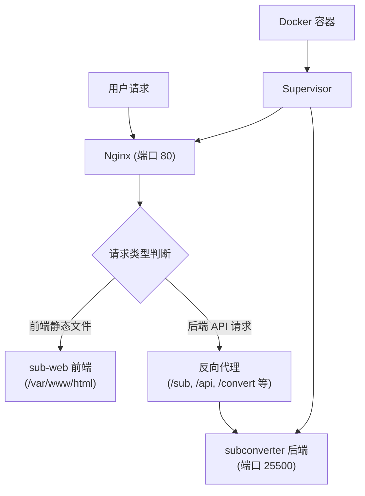

# Uni-Converter 订阅转换器

一个融合了前后端的订阅转换服务，基于 subconverter 后端和 sub-web 前端构建的 Docker 镜像。

## 📋 项目简介

Uni-Converter 是一个订阅转换服务，可以将各种格式的订阅链接转换为不同的客户端配置格式（如 Clash、V2Ray、Surge 等）。这个项目将 subconverter 后端和 sub-web 前端融合到一个 Docker 容器中，方便部署和使用。

## 🏗️ 项目架构



### 架构说明

1. **前端服务 (sub-web)**
   - 提供 Web 界面，方便用户进行订阅转换操作
   - 静态文件存储在 `/var/www/html` 目录
   - 通过 Nginx 提供 HTTP 服务

2. **后端服务 (subconverter)**
   - 提供订阅转换的 API 接口
   - 监听内部端口 25500
   - 支持多种订阅格式转换（Clash、V2Ray、Surge、SS、SSR、Trojan 等）

3. **Nginx 反向代理**
   - 监听 80 端口，对外提供服务
   - 前端请求直接返回静态文件
   - 后端 API 请求（如 `/sub`、`/api`、`/convert` 等路径）反向代理到 subconverter 后端

4. **Supervisor 进程管理**
   - 同时管理 Nginx 和 subconverter 两个服务
   - 自动重启崩溃的服务
   - 统一日志管理

## 📦 文件说明

- `Dockerfile` - Docker 镜像构建文件，使用多阶段构建
- `nginx.conf` - Nginx 配置文件，定义反向代理规则
- `supervisord.conf` - Supervisor 配置文件，管理服务进程

## 🚀 快速开始

### 前置要求

- Docker 已安装并运行
- 至少 2GB 可用磁盘空间

### 构建镜像

在项目目录下执行以下命令构建 Docker 镜像：

```bash
docker build -t uni-converter:latest .
```

构建过程可能需要几分钟，因为需要：
1. 下载并构建前端（sub-web）
2. 下载后端二进制文件（subconverter）
3. 安装运行时依赖

### 运行容器

构建完成后，使用以下命令运行容器：

```bash
docker run -d \
  --name uni-converter \
  --restart=unless-stopped \
  -p 8080:80 \
  uni-converter:latest
```

参数说明：
- `-d`: 后台运行
- `--name uni-converter`: 容器名称
- `--restart=unless-stopped`: 自动重启策略
- `-p 8080:80`: 端口映射，将容器的 80 端口映射到主机的 8080 端口

### 访问服务

容器启动后，可以通过以下地址访问：

- **前端界面**: http://localhost:8080
- **后端 API**: http://localhost:8080/sub?target=clash&url=订阅链接

## 🔧 配置说明

### 修改端口

如果需要修改映射端口，修改 `-p` 参数即可：

```bash
docker run -d \
  --name uni-converter \
  --restart=unless-stopped \
  -p 3000:80 \
  uni-converter:latest
```

### 自定义 Nginx 配置

如果需要修改 Nginx 配置，可以：

1. 编辑 `nginx.conf` 文件
2. 重新构建镜像
3. 或者通过挂载卷的方式覆盖配置文件：

```bash
docker run -d \
  --name uni-converter \
  --restart=unless-stopped \
  -p 8080:80 \
  -v /path/to/your/nginx.conf:/etc/nginx/sites-available/uni-converter \
  uni-converter:latest
```

### 持久化配置

subconverter 的配置文件位于 `/app/subconverter/config` 目录，如果需要持久化配置，可以挂载该目录：

```bash
docker run -d \
  --name uni-converter \
  --restart=unless-stopped \
  -p 8080:80 \
  -v /path/to/config:/app/subconverter/config \
  uni-converter:latest
```

## 📝 使用示例

### 通过前端界面使用

1. 打开浏览器访问 http://localhost:8080
2. 在界面中输入订阅链接
3. 选择目标格式（如 Clash、V2Ray 等）
4. 点击转换按钮
5. 复制生成的订阅链接

### 通过 API 直接使用

```bash
# 转换为 Clash 格式
curl "http://localhost:8080/sub?target=clash&url=你的订阅链接"

# 转换为 V2Ray 格式
curl "http://localhost:8080/sub?target=v2ray&url=你的订阅链接"

# 转换为 Surge 格式
curl "http://localhost:8080/sub?target=surge&url=你的订阅链接"
```

## 🔍 故障排查

### 查看容器日志

```bash
# 查看所有日志
docker logs uni-converter

# 实时查看日志
docker logs -f uni-converter
```

### 查看服务状态

进入容器查看 Supervisor 管理的服务状态：

```bash
docker exec uni-converter supervisorctl status
```

应该看到两个服务都在运行：
- `nginx`: RUNNING
- `subconverter`: RUNNING

### 检查端口占用

如果端口被占用，可以：

1. 查看占用端口的进程：
```bash
lsof -i :8080
```

2. 或者使用其他端口：
```bash
docker run -d \
  --name uni-converter \
  --restart=unless-stopped \
  -p 8081:80 \
  uni-converter:latest
```

### 重启容器

```bash
docker restart uni-converter
```

### 停止并删除容器

```bash
docker stop uni-converter
docker rm uni-converter
```

## 📚 依赖说明

### 构建时依赖

- **Node.js 18**: 用于构建前端（sub-web）
- **Ubuntu 22.04**: 运行环境基础镜像
- **Nginx**: Web 服务器和反向代理
- **Supervisor**: 进程管理工具

### 运行时依赖

- **libcurl4**: HTTP 客户端库
- **libssl3**: SSL/TLS 支持
- **ca-certificates**: CA 证书

### 外部服务

- **GitHub**: 下载 sub-web 前端源码和 subconverter 后端二进制文件

## ⚠️ 注意事项

1. **首次构建时间较长**: 因为需要下载和构建前端，首次构建可能需要 5-10 分钟
2. **端口冲突**: 确保映射的端口没有被其他服务占用
3. **网络连接**: 构建时需要能够访问 GitHub 下载源码和二进制文件
4. **资源消耗**: 建议至少分配 512MB 内存给容器
5. **配置持久化**: 如果需要自定义 subconverter 配置，记得挂载配置目录

## 🛠️ 开发说明

### 修改前端

如果需要修改前端代码：

1. 修改 `Dockerfile` 中的前端构建部分
2. 重新构建镜像

### 修改后端配置

subconverter 的配置文件位于容器内的 `/app/subconverter/config` 目录，可以通过挂载卷的方式修改。

### 更新版本

要更新到最新版本：

1. 删除旧镜像和容器
2. 重新构建镜像（会自动下载最新版本）
3. 启动新容器

## 📄 许可证

本项目基于以下开源项目：
- [subconverter](https://github.com/tindy2013/subconverter) - 后端转换服务
- [sub-web](https://github.com/CareyWang/sub-web) - 前端界面

请参考各自项目的许可证说明。

## 🤝 贡献

欢迎提交 Issue 和 Pull Request！

---

如果遇到问题，可以查看日志或提交 Issue 寻求帮助。

